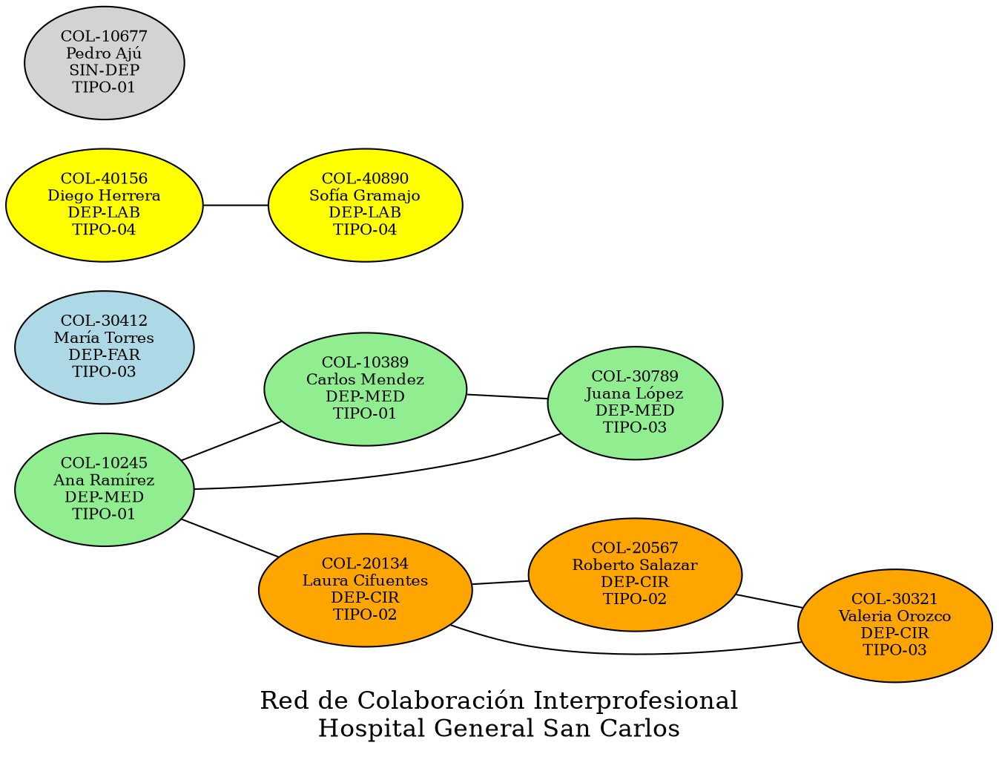

# Reporte Esperado — Grafo No Dirigido de Colaboraciones

Este documento describe cómo debería verse el reporte gráfico generado por Graphviz
a partir del archivo `conexiones_grafo.json` y los usuarios de `usuarios_masivo.json`.

---

## Nodos del grafo (10 profesionales)

Solo las relaciones con estado `ACTIVA` generan aristas. Las `PENDIENTE` y `RECHAZADA`
no aparecen como aristas en el grafo visual.

| No. Colegio | Nombre           | Tipo    | Departamento | Color nodo esperado |
|-------------|------------------|---------|--------------|---------------------|
| COL-10245   | Ana Ramírez      | TIPO-01 | DEP-MED      | Verde claro         |
| COL-10389   | Carlos Mendez    | TIPO-01 | DEP-MED      | Verde claro         |
| COL-20134   | Laura Cifuentes  | TIPO-02 | DEP-CIR      | Naranja             |
| COL-20567   | Roberto Salazar  | TIPO-02 | DEP-CIR      | Naranja             |
| COL-30412   | María Torres     | TIPO-03 | DEP-FAR      | Azul claro          |
| COL-30789   | Juana López      | TIPO-03 | DEP-MED      | Verde claro         |
| COL-40156   | Diego Herrera    | TIPO-04 | DEP-LAB      | Amarillo            |
| COL-40890   | Sofía Gramajo    | TIPO-04 | DEP-LAB      | Amarillo            |
| COL-10677   | Pedro Ajú        | TIPO-01 | SIN-DEP      | Gris                |
| COL-30321   | Valeria Orozco   | TIPO-03 | DEP-CIR      | Naranja             |

---

## Aristas activas (8 conexiones que sí aparecen en el grafo)

```
COL-10245 -- COL-10389   (Ana -- Carlos)
COL-10245 -- COL-30789   (Ana -- Juana)
COL-10389 -- COL-30789   (Carlos -- Juana)
COL-20134 -- COL-20567   (Laura -- Roberto)
COL-20134 -- COL-30321   (Laura -- Valeria)
COL-20567 -- COL-30321   (Roberto -- Valeria)
COL-40156 -- COL-40890   (Diego -- Sofía)
COL-10245 -- COL-20134   (Ana -- Laura)
```

---

## Estructura esperada del grafo (descripción visual)

### Cluster DEP-MED (verde claro)
Ana, Carlos y Juana forman un triángulo completamente conectado entre sí.
Los tres nodos deben aparecer próximos y con el mismo color.

### Cluster DEP-CIR (naranja)
Laura, Roberto y Valeria forman otro triángulo completamente conectado.
Adicionalmente, Laura tiene una arista hacia Ana (DEP-MED), creando el puente
interdepartamental principal del grafo.

### Cluster DEP-LAB (amarillo)
Diego y Sofía están conectados entre sí, formando un componente pequeño
sin conexión con los otros clusters (nodo-par aislado del resto en las activas).

### Nodos aislados (sin aristas activas)
- **María Torres (COL-30412 / DEP-FAR):** tiene dos solicitudes enviadas pero ambas
  en estado PENDIENTE o RECHAZADA, por lo que aparece como nodo aislado en gris azulado
  o con el color de DEP-FAR. No tiene ninguna arista.
- **Pedro Ajú (COL-10677 / SIN-DEP):** sin departamento asignado y su única solicitud
  está PENDIENTE. Aparece en **gris** según la especificación del enunciado para usuarios
  sin departamento. También nodo aislado.

---

## Lista de adyacencia esperada

```
COL-10245 (Ana Ramírez):       COL-10389, COL-30789, COL-20134
COL-10389 (Carlos Mendez):     COL-10245, COL-30789
COL-20134 (Laura Cifuentes):   COL-20567, COL-30321, COL-10245
COL-20567 (Roberto Salazar):   COL-20134, COL-30321
COL-30412 (María Torres):      (ninguno)
COL-30789 (Juana López):       COL-10245, COL-10389
COL-40156 (Diego Herrera):     COL-40890
COL-40890 (Sofía Gramajo):     COL-40156
COL-10677 (Pedro Ajú):         (ninguno)
COL-30321 (Valeria Orozco):    COL-20134, COL-20567
```

---

## Código DOT de referencia (Graphviz)

El sistema Perl debería generar algo equivalente a lo siguiente:



---

## Observaciones para el corrector

- El grafo tiene **2 componentes conectados** (el cluster MED+CIR unido por Ana-Laura,
  y el par LAB) más **2 nodos aislados** (María y Pedro).
- Ana Ramírez (COL-10245) es el nodo con mayor grado (3 aristas): hub principal.
- Las conexiones PENDIENTE de María, Pedro y Diego hacia otros nodos **no generan aristas**
  y solo deben aparecer en la cola de solicitudes del receptor.
- Las conexiones RECHAZADA no aparecen en ningún lado del grafo.
